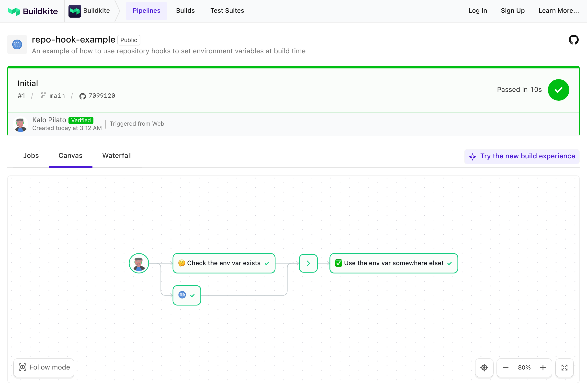

# Buildkite Pre-Command Environment Example

This repository is an example Buildkite pipeline that demonstrates how environment variables can be set through a [repository hook](https://buildkite.com/docs/agent/v3/hooks).

👉 **See this example in action:** [buildkite/repo-hook-example](https://buildkite.com/buildkite/repo-hook-example/builds/latest?branch=main)

See the full [Getting Started Guide](https://buildkite.com/docs/guides/getting-started) for step-by-step instructions on how to get this running, or try it yourself:

<!-- docs:start -->

## How it works

This pipeline demonstrates how to use the [`pre-command`](https://buildkite.com/docs/agent/v3/hooks#pre-command) hook to dynamically set environment variables at runtime for each job.

In this example:
- `.buildkite/hooks/pre-command` sets a `GIT_SHORT_HASH` variable
- `check_environment_var.sh` prints that variable
- The hook runs once per job and is scoped to that job context only

This can be helpful for injecting metadata into your builds without hardcoding values into your pipeline configuration.

## Notes

- Environment vars are scoped to a job context and cleaned up to prevent polluting other job contexts.
- The environment var exported by `pre-command` in this example is calculated every time a job in this pipeline is run.
- If the environment variable was expensive to calculate or non-deterministic, you might want to consider only calculating it during the pipeline upload step and setting the `env` inside the pipeline.yml

<!-- docs:end -->

## License

See [LICENSE](LICENSE) (MIT)
